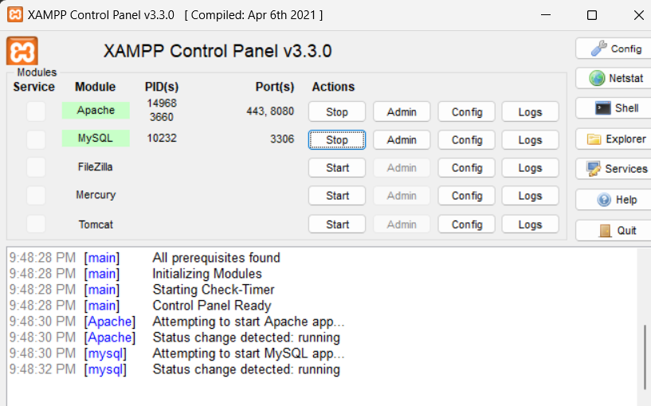
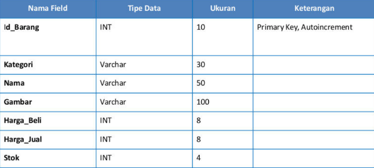
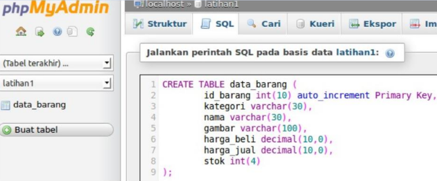

# Tugas Pemrograman web 2

Nama : Abdul Gofar 
NIM : 312210504 
Kelas : TI.22.B2 

# PHP

PHP adalah singkatan dari "Hypertext Preprocessor". Ini adalah bahasa pemrograman server-side yang digunakan secara luas untuk pengembangan web. Diciptakan oleh Rasmus Lerdorf pada tahun 1994, PHP awalnya adalah singkatan dari "Personal Home Page" (sekarang disebut "PHP: Hypertext Preprocessor"), yang menggambarkan awalnya sebagai alat untuk membangun situs web pribadi.  
PHP adalah bahasa skrip yang dapat disisipkan ke dalam HTML. Ini dikenal dengan kemampuannya untuk membuat halaman web dinamis dengan menyediakan fungsi untuk berinteraksi dengan basis data, menghasilkan konten yang dapat berubah secara dinamis, dan berkomunikasi dengan server web.  

## Langkah-langkah Praktikum

## Persiapan

Untuk memulai membuat aplikasi CRUD sederhana, yang perlu disiapkan adalah database server
menggunakan MySQL. Pastikan MySQL Server sudah dapat dijalankan melalui XAMPP.  

## Menjalankan MySQL Server

Untuk menjalankan MySQL Server dari menu XAMPP Contol.  

## Mengakses MySQL Client menggunakan PHP MyAdmin

Pastikan webserver Apache dan MySQL server sudah dijalankan. Kemudian buka melalui browser:  
http://localhost/phpmyadmin/  

## Membuat Database: Studi Kasus Data Barang

### Membuat Database

CREATE DATABASE latihan1;  

### Membuat Tabel
    CREATE TABLE data_barang (
    id_barang int(10) auto_increment Primary Key,
    kategori varchar(30),
    nama varchar(30),
    gambar varchar(100),
    harga_beli decimal(10,0),
    harga_jual decimal(10,0),
    stok int(4)
    ); 

